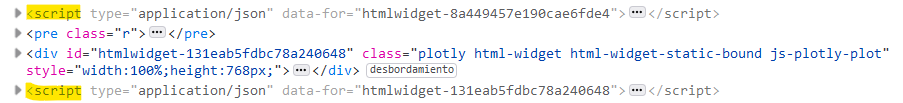

<br><br>

```{r setup, include=FALSE}
knitr::opts_chunk$set(echo = TRUE, out.width="100%", warning=FALSE, message=FALSE)
```

# Índice

1. Resumen
2. Introducción
    - Objetivo del caso práctico
    - Metodología de trabajo 
    - Formato R Markdown 
3. Estudio de los datos
    - España
    - Extremadura
    - Canarias
4. Conclusiones
5. Referencias


# Resumen

Los datos estudiados sobre la pandemia del virus COVID-19 en España evidencian una correlación entre el número de personas vacunadas y la evolución positiva de la pandemia, disminuyendo así el número de enfermos y hospitalizaciones. Asimismo, se observa como factores como las medidas políticas o el turismo influyen en la evolución de la pandemia, llegando incluso algunos de estos factores a que se frustre el progreso de la vacunación en un período determinado de tiempo este mismo año.

# Introducción

## Objetivo del caso práctico

Mostrar la influencia de la vacunación en la pandemia de la COVID-19, comparando los datos a partir del inicio de la vacunación con los datos de antes de la vacunación. 

## Metodología de trabajo

Se tratan los datos sobre la pandemia del virus COVID-19 obtenidos desde la página del Ministerio de sanidad, el repositorio de Datadista en Github y los datos de mortalidad del INE para obtener gráficas sobre la evolución diaria de la pandemia y la vacunación en los siguientes territorios: España, Extremadura y Canarias (en este orden).

## Formato R markdown 

Para convertir este documento de formato .rmd a .html ha sido necesario instalar un paquete en R llamado **knitr**. Este paquete tiene como objetivo generar informes a partir del código escrito en R implementando además la acción de otros paquetes en este proceso.

```{r Imagen: funcionamiento de knitr (referencia 1), echo=FALSE}

```

Knitr en este caso ha transformado el formato markdown a texto con formato estandarizado en html y el script de R en imágenes estáticas. Además, ha incluido el script de R que ha sido necesario para generar cada una de las gráficas encima de cada una de estas imágenes estáticas.

También he utilizado knitr para incluir imágenes externas al script de r, como la imagen del mono que hay más abajo.

<br>

```{r Imagen: mono de ejemplo, echo=TRUE}

```

<br>

Al principio del documento en R Markdown, he definido los comandos de knitr que irán asociados por defecto a cada fragmento de código en R.
```{r  Código de la configuración de knitr, eval=FALSE}
  knitr::opts_chunk$set(echo = TRUE, # El script de R ejecutado se imprimirá en el HTML a menos que se especifique lo contrario
                        
                        out.width="100%", # El ancho de las imágenes estáticas y gráficas interactivas que se generan a partir de las gráficas será del 100% disponible a menos que se especifique otro valor
                        
                        warning=FALSE, # Los avisos de la consola al ejecutar el código no se imprimirán en el HTML a menos que se especifique lo contrario
                        
                        message=FALSE) # Los mensajes de la consola al ejecutar el código no se imprimirán en el HTML a menos que se especifique lo contrario
```

No obstante, hay que tener en cuenta que las gráficas interactivas no funcionarían si knitr utiliza el mismo procedimiento que con las gráficas generadas con ggplot() (e incluso no se exportaría la imagen estática de las mismas sin instalar paquetes adicionales). 

Es por eso que para que no haya errores al exportar las gráficas interactivas es necesario instalar el paquete **htmlwidgets**. La función de htmlwidgets es la de exportar las gráficas interactivos de R junto con las librerías de Javascript necesarias para su correcta visualización. Este paquete interviene al visualizar la gráfica interactiva en las previsualizaciones de R, pero también interviene al exportar estas gráficas a HTML o a una aplicación de Shiny.

<br>

```{r Imagen: funcionamiento de htmlwidgets (referencia 2), echo=FALSE}

```

<br>

En la imagen anterior, se puede observar como al importar desde .rmd a .html se ha añadido código en Javascript a cada gráfica.


# Estudio de los datos

## Estudio de la pandemia en España

Para importar los datos necesarios para hacer las gráficas, vamos a necesitar el paquete **readr**. En este caso cargamos directamente la librería **tidyverse**, la cual incluye diversos paquetes que vamos a necesitar más adelante. 

```{r carga de tidyverse}
library(tidyverse)
```

Los paquetes que se cargan al ejecutar este comando son: ggplot2, purrr, tibble, dplyr, tidyr, stringr, readr y forcats. Una breve explicación de para qué sirve cada uno.

- **ggplot2**: crea elegantes gráficas a partir de los datos especificados y permite su modificación y personalización al añadir capas.
- **purr**: proporciona herramientas para trabajar con funciones y vectores.
- **tibble**: modificación del dataframe que gracias a sus restricciones obligan a enfrentarse con los problemas en el código antes de se acumulen los errores. Además contiene una modificación de la función *print()* que es más adecuada para grandes cantidades de datos y objetos complejos.
- **dplyr**: proporciona comandos para manipular datos enfrentándose a desafíos comunes.
- **tidyr**: ayuda a tener datos *tidy*, lo que facilitará trabajar con ellos cuando sean manipulados por otras herramientas del *tidyverse*.
- **stringr**: nos ayuda a manejar los datos que están en *strings* utilizando comandos que pueden modificarlos al encontrar patrones en estas series de datos.
- **readr**: puede importar datos en formato rectangular (como csv) de manera rápida y ordenada.
- **forcats**: trabaja con *factors*, un tipo de datos que se basa en las variables categóricas con un número determinado de valores fijos y conocidos.

### 1. Evolución diaria de la pandemia en España

Primero importamos los datos desde la URL del Ministerio de Sanidad.

```{r Importar datos del ministerio}
casos_diag_ccaa <- read_csv("https://cnecovid.isciii.es/covid19/resources/casos_diag_ccaadecl.csv")
casos_hosp_uci <- read_csv("https://cnecovid.isciii.es/covid19/resources/casos_hosp_uci_def_sexo_edad_provres.csv")
```

Para la gráfica de evolución diaria de nuevos casos de enfermos trabajaremos con el dataframe *casos_diag_ccaa*. Este dataframe recoge datos por cada comunidad autónoma, por eso agruparemos y sumamos por fecha para obtener el número total de nuevos casos en España.

```{r Gráfica: evolución diaria de nuevos casos de enfermos}
esp_casos_diag_ccaa <- casos_diag_ccaa %>% group_by(fecha) %>% summarize(num_casos = sum(num_casos), num_casos_prueba_pcr = sum(num_casos_prueba_pcr), num_casos_prueba_test_ac = sum(num_casos_prueba_test_ac), num_casos_prueba_ag = sum(num_casos_prueba_ag)) #Agrupamos por fecha y sumamos las columnas agrupadas

# Utilizamos las variables $fecha (fecha en la que se registra la información) y $num_casos (número de casos nuevos) del dataframe esp_casos_diag_ccaa que contiene solamente los datos diarios correspondientes a España.

ggplot(esp_casos_diag_ccaa, aes(x = fecha, y = num_casos)) + geom_col() + labs(title = "Evolución diaria de nuevos casos de enfermos",
              subtitle = "En España",
              caption = "Fuente: Ministerio de sanidad",
              x = "Fecha", y = "Número de casos") + geom_smooth()
```

**Observaciones sobre la gráfica: ** Al observar la línea de tendencia vemos que el mayor pico de coronavirus fue sobre el principio del año 2021, y que en general el número de enfermos se ha ido reduciendo.

En este mismo data frame, disponemos de los datos correspondientes al método para diagnosticar la enfermedad. En la siguiente gráfica se representa el número de casos según su forma de diagnóstico. He escogido las tres formas de diagnóstico más conocidas: prueba PCR, test de anticuerpos y prueba de detección de antígeno.

```{r Gráfica: métodos de diagnóstico}

# Utilizamos el mismo dataframe. Tres variables son de nueva introducción: $num_casos_prueba_pcr (número de casos con prueba de laboratorio PCR o técnicas moleculares), $num_casos_prueba_ag (número de casos con prueba de laboratorio de test de detección de antígeno) y $num_casos_prueba_test_ac (Número de casos con prueba de laboratorio de test rápido de anticuerpos).

ggplot(esp_casos_diag_ccaa, aes(x = fecha, y  = num_casos_prueba_pcr)) + geom_smooth() + geom_smooth(aes(y = num_casos_prueba_ag), color = "black") + geom_smooth(aes(y = num_casos_prueba_test_ac), color = "orange")  + labs(title = "Comparación entre los métodos de diagnóstico más comunes",
              subtitle = " - Azul: diagnóstico por PCR \n - Negro: diagnóstico por prueba de antígenos \n - Naranja: diagnóstico por test de anticuerpos",
              caption = "Fuente: Ministerio de sanidad",
              x = "Fecha", y = "Número de casos diagnosticados \n por este método")
```

**Observaciones sobre la gráfica: ** Al observar el número de casos que se ha diagnosticado en España por cada técnica, se observa como las pruebas PCR han sido la principal forma de diagnosticar a los enfermos. Los test de anticuerpos, pese a ser bastante mencionados en las noticias, no han sido una herramienta de diagnóstico muy utilizada.

<br> <br> <br> 

Para la gráfica de evolución diaria de número de fallecidos (y las siguientes) trabajaremos con el dataframe *casos_hosp_uci*. Este dataframe recoge datos por cada provincia, por eso agruparemos y sumamos por fecha para obtener el número total de nuevos casos en España.

```{r Gráfica: evolución diaria del número de fallecidos}
esp_casos_hosp_uci <- casos_hosp_uci %>% group_by(fecha) %>% summarize(num_casos = sum(num_casos), num_hosp = sum(num_hosp), num_uci = sum(num_uci), num_def = sum(num_def))

#Utilizamos las variables $fecha (fecha en la que se registra la información) y $num_def (número de defunciones por COVID-19) del dataframe esp_casos_hosp_uci que contiene solamente los datos diarios correspondientes a España.

ggplot(esp_casos_hosp_uci, aes(x = fecha, y = num_def)) + geom_col() + labs(title = "Evolución diaria de nuevos fallecidos",
              subtitle = "En España",
              caption = "Fuente: Ministerio de sanidad",
              x = "Fecha", y = "Número de fallecidos") + geom_smooth() 
```

**Observaciones sobre la gráfica: ** Al observar la línea de tendencia vemos que el mayor pico de fallecidos fue sobre el principio del año 2021, y que en general el número de fallecidos se ha ido reduciendo. Coincide en ese sentido con la tendencia del número de enfermos.

<br> <br> <br> 

Gráfica de evolución diaria de número de hospitalizados con el dataframe anterior:

```{r Gráfica: evolución diaria del número de hospitalizados}

#Utilizamos el dataframe anterior. Introducimos una nueva variable: $num_hosp (número de hospitalizados por COVID-19 diarios)

ggplot(esp_casos_hosp_uci, aes(x = fecha, y = num_hosp)) + geom_col() + labs(title = "Evolución diaria de nuevos hospitalizaciones",
              subtitle = "En España",
              caption = "Fuente: Ministerio de sanidad",
              x = "Fecha", y = "Número de hospitalizaciones") + geom_smooth() 
```

**Observaciones sobre la gráfica: ** Coincide de nuevo con las observaciones de las gráfica anterior.

<br> <br> <br> 

Gráfica de evolución diaria de número de enfermos en UCI netos con el dataframe anterior:

```{r Gráfica: evolución diaria del número de enfermos en UCI}

#Utilizamos el dataframe anterior. Introducimos una nueva variable: $num_uci (número de enfermos en UCI por COVID-19 diarios)

ggplot(esp_casos_hosp_uci, aes(x = fecha, y = num_uci)) + geom_col() + labs(title = "Evolución diaria de enfermos en UCI netos",
              subtitle = "En España",
              caption = "Fuente: Ministerio de sanidad",
              x = "Fecha", y = "Número de enfermos en UCI") + geom_smooth() 
```

**Observaciones sobre la gráfica: ** Coincide de nuevo con las observaciones de las gráfica anterior.

<br> <br> <br> 


A continuación voy a volver a representar las mismas gráficas pero por cada 100 000 habitantes.

```{r Gráfica: evolución diaria del número de enfermos por cada 100k habitantes}
esp_casos_diag_ccaa$censo_esp <- c(47394223) #Introducimos en una variable el censo de España
esp_casos_diag_ccaa$ev100k_num_casos <- (esp_casos_diag_ccaa$num_casos * 100000) / esp_casos_diag_ccaa$censo_esp #Calculamos el número de casos por 100 000 habitantes


ggplot(esp_casos_diag_ccaa, aes(x = fecha, y = ev100k_num_casos)) + geom_line(size = 1, color = "#182C61") + labs(title = "Evolución diaria de enfermos por cada 100 000 habitantes",
              subtitle = "En España",
              caption = "Fuente: Ministerio de sanidad",
              x = "Fecha", y = "Número de enfermos \n por cada 100 000 habitantes")
```

<br><br>

```{r Gráfica: evolución diaria del número de fallecidos por cada 100k habitantes}
esp_casos_hosp_uci$censo_esp <- c(47394223) #Introducimos en una variable el censo de España
esp_casos_hosp_uci$ev100k_num_def <- (esp_casos_hosp_uci$num_def * 100000) / esp_casos_hosp_uci$censo_esp #Calculamos el número de fallecidos por 100 000 habitantes


ggplot(esp_casos_hosp_uci, aes(x = fecha, y = ev100k_num_def)) + geom_line(size = 1, color = "#182C61") + labs(title = "Evolución diaria de fallecidos por cada 100 000 habitantes",
              subtitle = "En España",
              caption = "Fuente: Ministerio de sanidad",
              x = "Fecha", y = "Número de fallecidos \n por cada 100 000 habitantes")
```

<br><br>

```{r Gráfica: evolución diaria del número de hospitalizados por cada 100k habitantes}

esp_casos_hosp_uci$ev100k_num_hosp <- (esp_casos_hosp_uci$num_hosp * 100000) / esp_casos_hosp_uci$censo_esp #Calculamos el número de hospitalizados por 100 000 habitantes


ggplot(esp_casos_hosp_uci, aes(x = fecha, y = ev100k_num_hosp)) + geom_line(size = 1, color = "#182C61") + labs(title = "Evolución diaria de hospitalizaciones por cada 100 000 habitantes",
              subtitle = "En España",
              caption = "Fuente: Ministerio de sanidad",
              x = "Fecha", y = "Número de hospitalizaciones \n por cada 100 000 habitantes")
```

<br><br>

```{r Gráfica: evolución diaria del número de enfermos en UCI por cada 100k habitantes}

esp_casos_hosp_uci$ev100k_num_uci <- (esp_casos_hosp_uci$num_uci * 100000) / esp_casos_hosp_uci$censo_esp #Calculamos el número de hospitalizados por 100 000 habitantes


ggplot(esp_casos_hosp_uci, aes(x = fecha, y = ev100k_num_uci)) + geom_line() + geom_line(size = 1, color = "#182C61") + labs(title = "Evolución diaria de enfermos en UCI por cada 100 000 habitantes",
              subtitle = "En España",
              caption = "Fuente: Ministerio de sanidad",
              x = "Fecha", y = "Número de enfermos en UCI \n por cada 100 000 habitantes")
```

<br> <br>

Para hacer las mismas gráficas (pero esta vez de evolución acumulada) trabajaremos con los mismos data frame y con la misma sintaxis para las gráficas, solo que crearemos nuevas columnas con la suma acumulatoria utilizando la función *cumsum()*.

```{r Creación de columnas para la evolución acumulada}
#Creamos una columna de acumulados para cada variable
esp_casos_diag_ccaa$acum_num_casos <- cumsum(esp_casos_diag_ccaa$num_casos)
esp_casos_hosp_uci$acum_num_hosp <- cumsum(esp_casos_hosp_uci$num_hosp)
esp_casos_hosp_uci$acum_num_uci <- cumsum(esp_casos_hosp_uci$num_uci)
esp_casos_hosp_uci$acum_num_def <- cumsum(esp_casos_hosp_uci$num_def)
```

```{r Gráfica: evolución diaria del número de enfermos acumulados}

ggplot(esp_casos_diag_ccaa, aes(x = fecha, y = acum_num_casos)) + geom_line(size = 1, color = "#1B9CFC") + labs(title = "Evolución diaria de enfermos acumulados",
              subtitle = "En España",
              caption = "Fuente: Ministerio de sanidad",
              x = "Fecha", y = "Número de enfermos acumulados") + scale_y_continuous(labels = scales::comma)
```

<br> <br>

```{r Gráfica: evolución diaria del número de fallecidos acumulados}

ggplot(esp_casos_hosp_uci, aes(x = fecha, y = acum_num_def)) + geom_line(size = 1, color = "#1B9CFC") + labs(title = "Evolución diaria de fallecidos acumulados",
              subtitle = "En España",
              caption = "Fuente: Ministerio de sanidad",
              x = "Fecha", y = "Número de fallecidos acumulados") + scale_y_continuous(labels = scales::comma)
```


<br> <br>

```{r Gráfica: evolución diaria del número de hospitalizados acumulados}

ggplot(esp_casos_hosp_uci, aes(x = fecha, y = acum_num_hosp)) + geom_line(size = 1, color = "#1B9CFC") + labs(title = "Evolución diaria de hospitalizaciones acumuladas",
              subtitle = "En España",
              caption = "Fuente: Ministerio de sanidad",
              x = "Fecha", y = "Número de hospitalizaciones acumuladas") + scale_y_continuous(labels = scales::comma)
```


<br> <br>

```{r Gráfica: evolución diaria del número de enfermos en UCI acumulados}

ggplot(esp_casos_hosp_uci, aes(x = fecha, y = acum_num_uci)) + geom_line(size = 1, color = "#1B9CFC") + labs(title = "Evolución diaria de enfermos en UCI acumulados",
              subtitle = "En España",
              caption = "Fuente: Ministerio de sanidad",
              x = "Fecha", y = "Número de enfermos en UCI acumulados") + scale_y_continuous(labels = scales::comma)
```

### 2. Incidencia acumulada de la pandemia en España
Para calcular la incidencia acumulada vamos a reutilizar los datos de la evolución acumulada diaria del número de casos. Por lo tanto  el dataframe a utilizar es *esp_casos_diag_ccaa* y las variables serán *fecha* y el resultado de la función que he creado más abajo *iacumuladaesp*.
```{r Incidencia acumulada a 14 días}
# En la función, t es el número de días transcurridos desde el primer día existente en el dataframe sin filtrar y n el número de días para el que hacer la incidencia acumulada.
iacumuladaesp <- function(t, n) {(((esp_incidencia_acumulada_a$acum_num_casos[t]-esp_incidencia_acumulada_a$acum_num_casos[esp_incidencia_acumulada_a$num_fila - n])/esp_incidencia_acumulada_a$censo_esp)*100000)}

esp_incidencia_acumulada_a <- esp_casos_diag_ccaa
esp_incidencia_acumulada_a <- filter(esp_incidencia_acumulada_a, num_casos > 15)
esp_incidencia_acumulada_a <- esp_incidencia_acumulada_a %>% mutate(num_fila = c(15:(n()+14))) #Creamos una columna que contenga números enteros ordenados desde n hasta llenar la última fila del dataframe

# Suelo utilizar el operador $ para redefinir variables pero en este caso no me queda otra opción que utilizar mutate() de dplyr porque la función n() para introducir los números de fila solamente funciona en las funciones de dplyr.

esp_incidencia_acumulada_a$incidencia_acumulada <- iacumuladaesp(esp_incidencia_acumulada_a$num_fila, 14)

ggplot(esp_incidencia_acumulada_a, aes(x = fecha, y = incidencia_acumulada)) + geom_line(size = 1.5, color = "#006266") + labs(title = "Incidencia acumulada de casos a 14 días",
              subtitle = "En España",
              caption = "Fuente: Ministerio de sanidad",
              x = "Fecha", y = "Incidencia acumulada a 14 días") 
```

**Observaciones sobre la gráfica: ** La incidencia acumulada es un término epidemiológico que refleja la expansión de una enfermedad en una población y en un tiempo determinado. Este dato es determinante a la hora de tomar decisiones políticas. ^1^

<br>

Reutilizamos la función *iacumuladaesp* para calcular la incidencia acumulada a 10 y 7 días.

```{r Incidencia acumulada a 10 días}
#Redefinimos la función cambiando el dataframe del que cogemos los datos
iacumuladaesp <- function(t, n) {(((esp_incidencia_acumulada_b$acum_num_casos[t]-esp_incidencia_acumulada_b$acum_num_casos[esp_incidencia_acumulada_b$num_fila - n])/esp_incidencia_acumulada_b$censo_esp)*100000)}

esp_incidencia_acumulada_b <- esp_casos_diag_ccaa
esp_incidencia_acumulada_b <- filter(esp_incidencia_acumulada_b, num_casos > 10) #Esta vez filtramos para los valores mayores a 10
esp_incidencia_acumulada_b <- esp_incidencia_acumulada_b %>% mutate(num_fila = c(10:(n()+9))) #Creamos una columna que contenga números enteros ordenados desde n hasta llenar la última fila del dataframe
esp_incidencia_acumulada_b$incidencia_acumulada <- iacumuladaesp(esp_incidencia_acumulada_b$num_fila, 10)

ggplot(esp_incidencia_acumulada_b, aes(x = fecha, y = incidencia_acumulada)) + geom_line(size = 1.5, color = "#006266") + labs(title = "Incidencia acumulada de casos a 10 días",
              subtitle = "En España",
              caption = "Fuente: Ministerio de sanidad",
              x = "Fecha", y = "Incidencia acumulada a 10 días") 
```


```{r Incidencia acumulada a 7 días}
#Redefinimos la función cambiando el dataframe del que cogemos los datos
iacumuladaesp <- function(t, n) {(((esp_incidencia_acumulada_c$acum_num_casos[t]-esp_incidencia_acumulada_c$acum_num_casos[esp_incidencia_acumulada_c$num_fila - n])/esp_incidencia_acumulada_c$censo_esp)*100000)}

esp_incidencia_acumulada_c <- esp_casos_diag_ccaa
esp_incidencia_acumulada_c <- filter(esp_incidencia_acumulada_c, num_casos > 7) #Esta vez filtramos para los valores mayores a 7
esp_incidencia_acumulada_c <- esp_incidencia_acumulada_c %>% mutate(num_fila = c(7:(n()+6))) #Creamos una columna que contenga números enteros ordenados desde n hasta llenar la última fila del dataframe
esp_incidencia_acumulada_c$incidencia_acumulada <- iacumuladaesp(esp_incidencia_acumulada_c$num_fila, 7)

ggplot(esp_incidencia_acumulada_c, aes(x = fecha, y = incidencia_acumulada))  + geom_line(size = 1.5, color = "#006266") + labs(title = "Incidencia acumulada de casos a 7 días",
              subtitle = "En España",
              caption = "Fuente: Ministerio de sanidad",
              x = "Fecha", y = "Incidencia acumulada a 7 días") 
```

<br> <br>

### 3. Datos de vacunación en España

Primero importamos los datos desde la URL del repositorio de Datadista en GitHub. En este caso voy a utilizar un método distinto para importar los datos. Primero descargaré el archivo en el directorio de trabajo definido en r, buscaré la ruta local del archivo y utilizaré la función nativa de R *read.table*. 

```{r Importar los datos de vacunación}
download.file(
  url = "https://raw.githubusercontent.com/datadista/datasets/master/COVID%2019/ccaa_vacunas.csv",
  destfile = "datosVacunacionGit.csv", method = "curl", quiet = TRUE)

rutaVacunaGit <- paste(getwd(), "/datosVacunacionGit.csv", sep = "") # Obtener la ruta del archivo dentro del directorio de trabajo


datosVacunacionGit <- read.table(rutaVacunaGit,  skip = 0, header = TRUE, sep = ",")
```

Al importar los datos nos encontramos con un problema, y es que hay que limpiarlos antes de poder hacer cualquier gráfica con ellos. Vamos a utilizar la librería **stringr**, que ya está cargada con **tidyverse**.


```{r Limpiar los datos de vacunación}
# Primer paso: corregir los nombres de las variables

names(datosVacunacionGit) <- c("fecha_publicacion", "cod_ine", "ccaa", "dosis_entregadas_pfizer", "dosis_entregadas_moderna", "dosis_entregadas_astrazeneca", "dosis_entregadas_janssen", "dosis_entregadas_totales", "dosis_administradas", "porcentaje_de_dosis_administradas_por_100_habitantes", "porcentaje_sobre_entregadas", "personas_con_al_menos_una_dosis", "personas_con_pauta_completa", "porcentaje_con_pauta_completa", "fecha_de_la_ultima_vacuna_registrada")

# Segundo paso: eliminar los puntos para marcar los miles, ya que al pasar más adelante a formato número estos puntos se tratarán como comas decimales


datosVacunacionGit$dosis_entregadas_pfizer <- str_remove_all(datosVacunacionGit$dosis_entregadas_pfizer, "[.]")
datosVacunacionGit$dosis_entregadas_moderna <- str_remove_all(datosVacunacionGit$dosis_entregadas_moderna, "[.]")
datosVacunacionGit$dosis_entregadas_janssen <- str_remove_all(datosVacunacionGit$dosis_entregadas_janssen, "[.]")
datosVacunacionGit$dosis_entregadas_astrazeneca <- str_remove_all(datosVacunacionGit$dosis_entregadas_astrazeneca, "[.]")
datosVacunacionGit$dosis_entregadas_totales <- str_remove_all(datosVacunacionGit$dosis_entregadas_totales, "[.]")
datosVacunacionGit$dosis_administradas <- str_remove_all(datosVacunacionGit$dosis_administradas, "[.]")
datosVacunacionGit$personas_con_al_menos_una_dosis <- str_remove_all(datosVacunacionGit$personas_con_al_menos_una_dosis, "[.]")
datosVacunacionGit$personas_con_pauta_completa <- str_remove_all(datosVacunacionGit$personas_con_pauta_completa, "[.]")

#Tercer paso: cambiar las comas "," por puntos "." donde hace falta para que posteriormente sean reconocidos como comas decimales

datosVacunacionGit$porcentaje_de_dosis_administradas_por_100_habitantes <- str_replace_all(datosVacunacionGit$porcentaje_de_dosis_administradas_por_100_habitantes, "," , ".")
datosVacunacionGit$porcentaje_sobre_entregadas <- str_replace_all(datosVacunacionGit$porcentaje_sobre_entregadas, "," , ".")
datosVacunacionGit$porcentaje_con_pauta_completa <- str_replace_all(datosVacunacionGit$porcentaje_con_pauta_completa, "," , ".")

# Cuarto paso: pasar a formato numérico las variables que deberían ser numéricas

datosVacunacionGit$dosis_entregadas_pfizer <- as.numeric(datosVacunacionGit$dosis_entregadas_pfizer)
datosVacunacionGit$dosis_entregadas_moderna <- as.numeric(datosVacunacionGit$dosis_entregadas_moderna)
datosVacunacionGit$dosis_entregadas_janssen <- as.numeric(datosVacunacionGit$dosis_entregadas_janssen)
datosVacunacionGit$dosis_entregadas_astrazeneca <- as.numeric(datosVacunacionGit$dosis_entregadas_astrazeneca)
datosVacunacionGit$dosis_entregadas_totales <- as.numeric(datosVacunacionGit$dosis_entregadas_totales)
datosVacunacionGit$dosis_administradas <- as.numeric(datosVacunacionGit$dosis_administradas)
datosVacunacionGit$porcentaje_de_dosis_administradas_por_100_habitantes <- as.numeric(datosVacunacionGit$porcentaje_de_dosis_administradas_por_100_habitantes)
datosVacunacionGit$porcentaje_sobre_entregadas <- as.numeric(datosVacunacionGit$porcentaje_sobre_entregadas)
datosVacunacionGit$personas_con_al_menos_una_dosis <- as.numeric(datosVacunacionGit$personas_con_al_menos_una_dosis)
datosVacunacionGit$personas_con_pauta_completa <- as.numeric(datosVacunacionGit$personas_con_pauta_completa)
datosVacunacionGit$porcentaje_con_pauta_completa <- as.numeric(datosVacunacionGit$porcentaje_con_pauta_completa)

# Quinto paso: pasar a formato fecha las variables que dependan del tiempo

datosVacunacionGit$fecha_publicacion <- as.Date(datosVacunacionGit$fecha_publicacion)


# Sexto paso: sustituir los valores nulos por ceros

datosVacunacionGit$dosis_entregadas_pfizer <- datosVacunacionGit$dosis_entregadas_pfizer %>% replace_na(0)

datosVacunacionGit$dosis_entregadas_moderna <- datosVacunacionGit$dosis_entregadas_moderna %>% replace_na(0)

datosVacunacionGit$dosis_entregadas_astrazeneca <- datosVacunacionGit$dosis_entregadas_astrazeneca %>% replace_na(0)

datosVacunacionGit$dosis_entregadas_janssen <- datosVacunacionGit$dosis_entregadas_janssen %>% replace_na(0)

datosVacunacionGit$dosis_entregadas_totales <- datosVacunacionGit$dosis_entregadas_totales %>% replace_na(0)

datosVacunacionGit$dosis_administradas <- datosVacunacionGit$dosis_administradas %>% replace_na(0)

datosVacunacionGit$porcentaje_de_dosis_administradas_por_100_habitantes <- datosVacunacionGit$porcentaje_de_dosis_administradas_por_100_habitantes %>% replace_na(0)

datosVacunacionGit$porcentaje_sobre_entregadas <- datosVacunacionGit$porcentaje_sobre_entregadas %>% replace_na(0)

datosVacunacionGit$personas_con_al_menos_una_dosis <- datosVacunacionGit$personas_con_al_menos_una_dosis %>% replace_na(0)

datosVacunacionGit$personas_con_pauta_completa <- datosVacunacionGit$personas_con_pauta_completa %>% replace_na(0)

datosVacunacionGit$porcentaje_con_pauta_completa <- datosVacunacionGit$porcentaje_con_pauta_completa %>% replace_na(0)

```

Ahora que los datos están limpios vamos a filtrar los valores para España. Los nombres de las comunidades autónomas también dan problemas al importarlos con tildes, pero en este caso vamos a filtrar por el código que se le asocia a España (que es el 0). Además, creamos una nueva variable para obtener las dosis administradas diarias utilizando la función *lag()* de dplyr.

```{r Datos de vacunación para España}
esp_datosVacunacionGit <- datosVacunacionGit %>% filter(cod_ine == "0" & ccaa == "España") %>% select(-ccaa, -cod_ine, -fecha_de_la_ultima_vacuna_registrada) 

# Incorporamos la columna de dosis administradas diarias

esp_datosVacunacionGit$dosis_administradas_diarias <- esp_datosVacunacionGit$dosis_administradas - lag(esp_datosVacunacionGit$dosis_administradas, 1)
esp_datosVacunacionGit$dosis_administradas_diarias[1] <- 0 # Sustituimos el valor nulo inicial por 0
```

```{r Gráfica: vacunación acumulada en España}
ggplot(esp_datosVacunacionGit, aes(x = fecha_publicacion, y = dosis_administradas)) + geom_col(color = "#130f40") + theme(panel.background = element_rect(fill = "#dff9fb", colour = NA), panel.grid.major = element_blank(), panel.grid.minor = element_blank()) + labs(title = "Dosis administradas acumuladas",
              subtitle = "En España",
              caption = "Fuente: Datadista",
              x = "Fecha", y = "Dosis administradas acumuladas") + scale_y_continuous(labels = scales::comma)
```
<br>

Para las gráficas del número de vacunas entregadas según la marca voy a utilizar un nuevo tipo de gráfica para la que hará falta un nuevo paquete, además de crear un nuevo tipo de datos que hasta el momento no había utilizado.

```{r Gráfica: autoplot del número de vacunas entregadas según la marca}
# Después de instalar ggfortify.

library(ggfortify) # Ampliación de las funciones de ggplot2, incluyendo la función que nos hace falta: autoplot()

# Creamos un nuevo objeto basado en tiempo, esto es un cierto número de observaciones distribuidas a lo largo de un período de tiempo determinado y con una frecuencia definida. En este caso utilizaré un objeto ts para el que no será necesario instalar ningún otro paquete. Además puedo convertir mis variables del dataframe de vacunación a objetos ts con la función as.ts(), ya que están basadas en tiempo y son numéricas.

ts_esp_datosVacunacionGit <- as.ts(select(esp_datosVacunacionGit, dosis_entregadas_astrazeneca, dosis_entregadas_janssen, dosis_entregadas_moderna, dosis_entregadas_pfizer)) #En el objeto ts solamente estarán las variables de dosis entregadas según la marca.
autoplot(ts_esp_datosVacunacionGit) + labs(title = "Número de vacunas entregadas según marca",
              subtitle = "En España",
              caption = "Fuente: Datadista",
              x = "Número de días transcurridos", y = "Dosis entregadas") + scale_y_continuous(labels = scales::comma)
```

**Observaciones sobre la gráfica: ** Se aprecia como las entregas más constantes y numerosas han sido las de Pfizer, seguidas de las de Moderna, AstraZeneca y Janssen.

<br>

Para la gráfica de evolución de la vacunación **diaria** en España vamos a necesitar dos paquetes nuevos. El primer paquete nos permitirá crear una gráfica interactiva que permite modificar el rango de selección de datos del eje x (en este caso el perídodo de tiempo). El segundo paquete nos permitirá crear un nuevo tipo de objeto basado en observaciones a lo largo del tiempo llamado **xts**. En esta ocasión no utilizamos un objeto ts por recomendación de la documentación de *dygraphs*, donde recomiendan utilizar objetos xts.

```{r Gráfica: vacunacion diaria (dosis administradas) en España}
# Después de instalar dygraphs y xts

library(dygraphs) # Introduce la librería de dygraphs para Javascript en R, permitiendo crear gráficas interactivas a partir de objetos xts.
library(xts) # Permite crear objetos xts.
xts_esp_datosVacunacionGit <- xts(x = esp_datosVacunacionGit$dosis_administradas_diarias, order.by = esp_datosVacunacionGit$fecha_publicacion)


dygraph(xts_esp_datosVacunacionGit, main = "Evolución diaria de la vacunación en España") %>% dyRangeSelector()

# En la siguiente gráfica se puede hacer hover sobre los datos para conocer el número de vacunados diarios en un momento determinado. Se puede ajustar el rango de fechas que toma el eje x moviendo los extremos de la barra que hay bajo la gráfica.

```

<br> <br>

Para terminar el apartado de vacunación, he decidido hacer una gráfica interactiva en la que se compara el número de enfermos por covid con la curva de vacunación. El objetivo es crear una variable del porcentaje de enfermos por 100 000 habitantes en España y otra variable del porcentaje de la población vacunada en España. Una vez creadas, las comparo en una misma gráfica en la que la fecha se encuentra en el eje x.

El primer problema a resolver para poder lograr hacer la gráfica es la escasa concordancia entre las fechas de los dataframes de vacunación y del número de casos. Las fechas en las que se registran los datos difieren en cada uno de estos dataframes. Para encontrar las fechas en común en ambos dataframes y unir estos datos vamos a necesitar instalar un nuevo paquete llamado **fuzzyjoin**. Gracias a este paquete podremos encontrar las coincidencias entre los datos de cada dataframe y luego unirlos en uno nuevo.

```{r Dataframe: comparación de vacunación y casos en España}
# Después de instalar fuzzyjoin

library(fuzzyjoin)

esp_vacunacionVScasos <- data.frame("fecha" = esp_casos_hosp_uci$fecha, "num_casos" = esp_casos_hosp_uci$num_casos) # Creamos el nuevo dataframe que contiene los datos de enfermos acumulados y la columna de fechas de ese dataframe.

esp_vacunacionVScasos <- esp_vacunacionVScasos %>% 
  stringdist_inner_join(esp_datosVacunacionGit, by = c("fecha" = "fecha_publicacion"), max_dist = 0, distance_col = "distance")
# Al establecer max_dist = 0 solo las coincidencias exactas con la fecha se han copiado. Además he incluido la columna "distance" para poder detectar errores en el caso de que los hubiera, ya que el valor de esta variable siempre debe ser 0 en este caso.

esp_vacunacionVScasos$censo_esp <- c(47394223) #Introducimos el censo de España

esp_vacunacionVScasos <- esp_vacunacionVScasos %>% mutate(enfermos_diarios_por_100khab = (num_casos*100000) / censo_esp, porcentaje_vacunados = (personas_con_pauta_completa/censo_esp)*100) # Creamos las variables que vamos a utilizar en la gráfica mediante operaciones con otras variables.
```

Ahora que ya tenemos el dataframe y las variables que nos hacen falta vamos a crear el gráfico interactivo. Esta vez voy a utilizar el paquete **plotly**. Para hacer un gráfico interactivo con **plotly** se pueden seguir distintos pasos. En este caso he convertido mis gráficas de *ggplot2* a gráficas interactivas de **plotly**. 

```{r Gráfica: vacunados (%) vs enfermos (enfermos por 100 000 habitantes)}
# Tras haber instalado plotly

library(plotly) # Plotly utiliza la librería plotly.js de Javascript para crear los gráficos interactivos. Ofrece muchas posibilidades, como la creación de animaciones o controles personalizados, por eso es una muy buena opción para las aplicaciones con Shiny.

plotly_esp_vacunacionVScasos <- ggplot(esp_vacunacionVScasos, aes(x = fecha, y = enfermos_diarios_por_100khab)) + geom_line() + geom_line(aes(y = porcentaje_vacunados), color = "red", linetype = "solid") + labs(title = "% de vacunados en comparación con el nº de enfermos por 100 000 habitantes",
              subtitle = "",
              caption = "Fuente: Ministerio de sanidad y Datadista",
              x = "Fecha", y="") # Creamos la gráfica en ggplot2
plotly_esp_vacunacionVScasos <- ggplotly(plotly_esp_vacunacionVScasos) %>% layout(hovermode = 'x') # La pasamos a gráfica de plotly y establecemos la opción de comparar los datos en la y por defecto.
plotly_esp_vacunacionVScasos

#Los gráficos de plotly permiten hacer zoom en cualquier parte del gráfico para observar las tendencias con más detenimiento. Al hacer hover aparece la leyenda. Además, se puede descargar el gráfico en png después de modificarlo haciendo clic en el botón de la cámara en la barra de herramientas de la esquina superior derecha.
```

<br><br>

Comparación del número de enfermos por grupos de edad en distintas fechas (en la izquierda desde que la curva de vacunación va por primera vez por encima de la curva de enfermos por 100 000 habitantes, en la derecha desde que la curva de vacunación alcanza el 74% aproximadamente.) Es necesario instalar el paquete **ggpubr** para combinar las gráficas en un grid.

```{r Gráficas: número de enfermos por grupo de edad}
# Tras instalar ggpubr

library(ggpubr) # Permite distribuir y anotar los gráficos de ggplot2 a la hora de introducirlos en un informe.

theme_set(theme_pubr()) # Establecemos los ajustes de ggpubr para optimice los gráficos pensando en publicarlos en un informe.

gedad_esp_casos_hosp_uci <- casos_hosp_uci %>% group_by(fecha, grupo_edad) %>% summarize(num_casos = sum(num_casos))
gedad_esp_casos_hosp_uci <- gedad_esp_casos_hosp_uci %>% select(fecha, grupo_edad, num_casos)


plot_gedad_esp_casos_hosp_uci_a <- ggplot(data = gedad_esp_casos_hosp_uci) + 
geom_col(mapping = aes(x= fecha, y =  num_casos, fill = grupo_edad), position = "dodge") + scale_x_date(limits = as.Date(c("2021-05-09","2021-05-11"))) + ylim(0, 2000)+ theme(axis.text.x = element_text(angle = 90, vjust = 0.5, hjust=1)) + labs(fill = "Grupo de edad", caption = "Fuente: Ministerio de sanidad", x = "Fecha", y = "Número de casos diarios")

plot_gedad_esp_casos_hosp_uci_b <- ggplot(data = gedad_esp_casos_hosp_uci) + 
  geom_col(mapping = aes(x= fecha, y = num_casos, fill = grupo_edad), position = "dodge") + scale_x_date(limits = as.Date(c("2021-09-09","2021-09-11"))) + ylim(0, 2000)+ theme(axis.text.x = element_text(angle = 90, vjust = 0.5, hjust=1)) + labs(fill = "Grupo de edad", caption = "Fuente: Ministerio de sanidad", x = "Fecha", y = "Número de casos diarios")

plot_gedad_esp_casos_hosp_uci_combined <- ggarrange(plot_gedad_esp_casos_hosp_uci_a, plot_gedad_esp_casos_hosp_uci_b, labels = c("   Mayo de 2021", "Septiembre de 2021"), ncol = 2, nrow = 1, common.legend = TRUE, legend = "bottom")
plot_gedad_esp_casos_hosp_uci_combined
```

**Observaciones sobre la gráfica: ** Se aprecia como el número de casos por cada grupo de edad ha bajado considerablemente al haber alcanzado el hito del 74% de vacunación de la población Española. No obstante, los casos en el grupo de edad de 0 a 9 años apenas ha variado desde que el avance de vacunación no era tan importante.

<br><br>


### 4. Datos de mortalidad general en España

Ahora vamos a estudiar los datos de mortalidad en España. Para ello es necesario importar un nuevo dataframe.

```{r Importar los datos de mortalidad}
momo_iscii <- read_csv("https://momo.isciii.es/public/momo/data", col_names = TRUE) # Usamos el paquete readr

gedad_esp_momo_iscii <- filter(momo_iscii, ambito == "nacional", nombre_sexo == "todos") # Filtramos para conseguir los datos de España, dejando el grupo de edad para la primera gráfica

# Ahora filtramos de nuevo el dataframe para obtener los datos para todos los grupos de edad (segunda gráfica).
esp_momo_iscii <- filter(momo_iscii, ambito == "nacional", nombre_sexo == "todos", nombre_gedad == "todos")

#Utilizaremos las variables fecha_defuncion (fecha de defunción) y defunciones_observadas (defunciones en el día en cuestión)
```

Para comparar las defunciones observadas por grupo de edad, voy a crear una gráfica de cajas con el paquete **lattice**. Por ello primero debemos instalar **lattice**.

```{r Gráfica: defunciones por grupo de edad en España (con lattice)}
#  Tras instalar lattice

library(lattice) # Se basa en una versión mejorada de las gráficas por defecto de R, pero destaca por la simplicidad a la hora de crear gráficas multivariable. También permite crear gráficas "trellis" que representan una variable o relación entre varias (estando esta representación condicionada a su vez por una o más variables).

xyplot(defunciones_observadas ~ fecha_defuncion | nombre_gedad, data = gedad_esp_momo_iscii, main="Defunciones en España por grupo de edad", ylab = "Defunciones observadas", xlab="Fecha") 


```

Para comparar los fallecidos en 2021 con los de 2020 voy a crear un grid en el que estarán ambas gráficas. Usaré el paquete **ggpubr** para conseguir esto.

```{r Gráfica: comparación de fallecidos en 2020 y 2021 en España}
# Ya habíamos utilizado ggpubr antes

library(ggpubr) 

theme_set(theme_pubr()) 

plot_esp_momo_iscii_a <- ggplot(esp_momo_iscii, aes(x = fecha_defuncion, y = defunciones_observadas)) + geom_line() + scale_x_date(limits = as.Date(c("2020-01-01","2020-12-30")))+ theme(axis.text.x = element_text(angle = 90, vjust = 0.5, hjust=1)) + labs(caption = "Fuente: MoMo (iscii / INE)", x = "Fecha de la defunción", y = "Defunciones observadas")
plot_esp_momo_iscii_b <- ggplot(esp_momo_iscii, aes(x = fecha_defuncion, y = defunciones_observadas)) + geom_line() + scale_x_date(limits = as.Date(c("2021-01-01","2021-12-30")))+ theme(axis.text.x = element_text(angle = 90, vjust = 0.5, hjust=1)) + labs(caption = "Fuente: MoMo (iscii / INE)", x = "Fecha de la defunción", y = "Defunciones observadas")

plot_esp_momo_iscii_combined <- ggarrange(plot_esp_momo_iscii_a, plot_esp_momo_iscii_b, labels = c("Defunciones en 2020", "Defunciones en 2021"), ncol = 2, nrow = 1)  #Juntamos las dos gráficas que hemos creado en una sola

plot_esp_momo_iscii_combined

```

**Observaciones sobre la gráfica: ** Se aprecia como el existe un aumento evidente en el número de defunciones alrededor de la fecha del primer confinamiento en España.

<br> <br> <br>

## Estudio de la pandemia en Extremadura

Para estudiar la pandemia en cada comunidad autónoma voy a reutilizar mi código, ya que mantendré el nombre de las variables al filtrar los datos para comunidad desde los dataframe iniciales. Los nombres de los dataframes contendran "extremadura" o "ex" en lugar de "esp".

Filtramos los datos.

```{r Filtrar los dataframes para Extremadura}

extremadura_casos_diag_ccaa <- filter(casos_diag_ccaa, ccaa_iso == "EX")
extremadura_casos_hosp_uci <- bind_rows(filter(casos_hosp_uci,provincia_iso == "CC"), filter(casos_hosp_uci,provincia_iso == "BA"))
extremadura_casos_hosp_uci <- select(extremadura_casos_hosp_uci, -sexo, -grupo_edad, -provincia_iso)


# Si convertimos la variable $fecha en este último dataframe usando as.Date nos problemas, por eso lo pasaremos al formato fecha de lubridate, un paquete que está pensado para que transformar y operar con fechas sea más sencillo. Al ser lubridate del tidyverse podemos utilizarlo con mutate() de dyplr para convertir la columna de fecha a formato fecha sin complicaciones.

library(lubridate) # Al haber instalado tidyverse lubridate debería estar instalado, aunque al hacer library(tidyverse) no se carga.

extremadura_casos_hosp_uci <- extremadura_casos_hosp_uci %>%
  mutate(fecha = date(fecha)) %>%
  group_by(fecha) %>%
  summarize(num_casos = sum(num_casos), num_hosp = sum(num_hosp), num_uci = sum(num_uci), num_def = sum(num_def))

```


### 1. Evolución diaria de la pandemia en Extremadura

```{r B-Gráfica: evolución diaria de nuevos casos de enfermos}

# Utilizamos las variables $fecha (fecha en la que se registra la información) y $num_casos (número de casos nuevos) del dataframe extremadura_casos_diag_ccaa que contiene solamente los datos diarios correspondientes a Extremadura

ggplot(extremadura_casos_diag_ccaa, aes(x = fecha, y = num_casos)) + geom_col() + labs(title = "Evolución diaria de nuevos casos de enfermos",
              subtitle = "En Extremadura",
              caption = "Fuente: Ministerio de sanidad",
              x = "Fecha", y = "Número de casos") + geom_smooth()
```

```{r B-Gráfica: métodos de diagnóstico}

# Utilizamos el mismo dataframe. Tres variables son de nueva introducción: $num_casos_prueba_pcr (número de casos con prueba de laboratorio PCR o técnicas moleculares), $num_casos_prueba_ag (número de casos con prueba de laboratorio de test de detección de antígeno) y $num_casos_prueba_test_ac (Número de casos con prueba de laboratorio de test rápido de anticuerpos).

ggplot(extremadura_casos_diag_ccaa, aes(x = fecha, y  = num_casos_prueba_pcr)) + geom_smooth() + geom_smooth(aes(y = num_casos_prueba_ag), color = "black") + geom_smooth(aes(y = num_casos_prueba_test_ac), color = "orange")  + labs(title = "Comparación entre los métodos de diagnóstico más comunes",
              subtitle = " - Azul: diagnóstico por PCR \n - Negro: diagnóstico por prueba de antígenos \n - Naranja: diagnóstico por test de anticuerpos",
              caption = "Fuente: Ministerio de sanidad",
              x = "Fecha", y = "Número de casos diagnosticados \n por este método")
```


```{r B-Gráfica: evolución diaria del número de fallecidos}

#Utilizamos las variables $fecha (fecha en la que se registra la información) y $num_def (número de defunciones por COVID-19) del dataframe extremadura_casos_hosp_uci que contiene solamente los datos diarios correspondientes a Extremadura.

ggplot(extremadura_casos_hosp_uci, aes(x = fecha, y = num_def)) + geom_col() + labs(title = "Evolución diaria de nuevos fallecidos",
              subtitle = "En Extremadura",
              caption = "Fuente: Ministerio de sanidad",
              x = "Fecha", y = "Número de fallecidos") + geom_smooth() 
```

```{r B-Gráfica: evolución diaria del número de hospitalizados}

#Utilizamos el dataframe anterior. Introducimos una nueva variable: $num_hosp (número de hospitalizados por COVID-19 diarios)

ggplot(extremadura_casos_hosp_uci, aes(x = fecha, y = num_hosp)) + geom_col() + labs(title = "Evolución diaria de nuevos hospitalizaciones",
              subtitle = "En Extremadura",
              caption = "Fuente: Ministerio de sanidad",
              x = "Fecha", y = "Número de hospitalizaciones") + geom_smooth() 
```

```{r B-Gráfica: evolución diaria del número de enfermos en UCI}

#Utilizamos el dataframe anterior. Introducimos una nueva variable: $num_uci (número de enfermos en UCI por COVID-19 diarios)

ggplot(extremadura_casos_hosp_uci, aes(x = fecha, y = num_uci)) + geom_col() + labs(title = "Evolución diaria de enfermos en UCI netos",
              subtitle = "En Extremadura",
              caption = "Fuente: Ministerio de sanidad",
              x = "Fecha", y = "Número de enfermos en UCI") + geom_smooth() 
```

```{r B-Tabla: evolución diaria del número de enfermos por cada 100k habitantes}
extremadura_casos_diag_ccaa$censo_extremadura <- c(1057999) #Introducimos en una variable el censo de Extremadura
extremadura_casos_diag_ccaa$ev100k_num_casos <- (extremadura_casos_diag_ccaa$num_casos * 100000) / extremadura_casos_diag_ccaa$censo_extremadura #Calculamos el número de casos por 100 000 habitantes

```

```{r B-Gráfica: evolución diaria del número de enfermos por cada 100k habitantes}
ggplot(extremadura_casos_diag_ccaa, aes(x = fecha, y = ev100k_num_casos)) + geom_line(size = 1, color = "#182C61") + labs(title = "Evolución diaria de enfermos por cada 100 000 habitantes",
              subtitle = "En Extremadura",
              caption = "Fuente: Ministerio de sanidad",
              x = "Fecha", y = "Número de enfermos \n por cada 100 000 habitantes")
```

```{r B-Gráfica: evolución diaria del número de fallecidos por cada 100k habitantes}
extremadura_casos_hosp_uci$censo_extremadura <- c(1057999) #Introducimos en una variable el censo de Extremadura
extremadura_casos_hosp_uci$ev100k_num_def <- (extremadura_casos_hosp_uci$num_def * 100000) / extremadura_casos_hosp_uci$censo_extremadura #Calculamos el número de fallecidos por 100 000 habitantes


ggplot(extremadura_casos_hosp_uci, aes(x = fecha, y = ev100k_num_def)) + geom_line(size = 1, color = "#182C61") + labs(title = "Evolución diaria de fallecidos por cada 100 000 habitantes",
              subtitle = "En Extremadura",
              caption = "Fuente: Ministerio de sanidad",
              x = "Fecha", y = "Número de fallecidos \n por cada 100 000 habitantes")
```
```{r B-Gráfica: evolución diaria del número de hospitalizados por cada 100k habitantes}

extremadura_casos_hosp_uci$ev100k_num_hosp <- (extremadura_casos_hosp_uci$num_hosp * 100000) / extremadura_casos_hosp_uci$censo_extremadura #Calculamos el número de hospitalizados por 100 000 habitantes


ggplot(extremadura_casos_hosp_uci, aes(x = fecha, y = ev100k_num_hosp)) + geom_line(size = 1, color = "#182C61") + labs(title = "Evolución diaria de hospitalizaciones por cada 100 000 habitantes",
              subtitle = "En Extremadura",
              caption = "Fuente: Ministerio de sanidad",
              x = "Fecha", y = "Número de hospitalizaciones \n por cada 100 000 habitantes")
```
```{r B-Gráfica: evolución diaria del número de enfermos en UCI por cada 100k habitantes}

extremadura_casos_hosp_uci$ev100k_num_uci <- (extremadura_casos_hosp_uci$num_uci * 100000) / extremadura_casos_hosp_uci$censo_extremadura #Calculamos el número de hospitalizados por 100 000 habitantes


ggplot(extremadura_casos_hosp_uci, aes(x = fecha, y = ev100k_num_uci)) + geom_line() + geom_line(size = 1, color = "#182C61") + labs(title = "Evolución diaria de enfermos en UCI por cada 100 000 habitantes",
              subtitle = "En Extremadura",
              caption = "Fuente: Ministerio de sanidad",
              x = "Fecha", y = "Número de enfermos en UCI \n por cada 100 000 habitantes")
```
```{r B-Creación de columnas para la evolución acumulada}
#Creamos una columna de acumulados para cada variable
extremadura_casos_diag_ccaa$acum_num_casos <- cumsum(extremadura_casos_diag_ccaa$num_casos)
extremadura_casos_hosp_uci$acum_num_hosp <- cumsum(extremadura_casos_hosp_uci$num_hosp)
extremadura_casos_hosp_uci$acum_num_uci <- cumsum(extremadura_casos_hosp_uci$num_uci)
extremadura_casos_hosp_uci$acum_num_def <- cumsum(extremadura_casos_hosp_uci$num_def)
```

```{r B-Gráfica: evolución diaria del número de enfermos acumulados}

ggplot(extremadura_casos_diag_ccaa, aes(x = fecha, y = acum_num_casos)) + geom_line(size = 1, color = "#1B9CFC") + labs(title = "Evolución diaria de enfermos acumulados",
              subtitle = "En Extremadura",
              caption = "Fuente: Ministerio de sanidad",
              x = "Fecha", y = "Número de enfermos acumulados") + scale_y_continuous(labels = scales::comma)
```
```{r B-Gráfica: evolución diaria del número de fallecidos acumulados}

ggplot(extremadura_casos_hosp_uci, aes(x = fecha, y = acum_num_def)) + geom_line(size = 1, color = "#1B9CFC") + labs(title = "Evolución diaria de fallecidos acumulados",
              subtitle = "En Extremadura",
              caption = "Fuente: Ministerio de sanidad",
              x = "Fecha", y = "Número de fallecidos acumulados") + scale_y_continuous(labels = scales::comma)
```
```{r B-Gráfica: evolución diaria del número de hospitalizados acumulados}

ggplot(extremadura_casos_hosp_uci, aes(x = fecha, y = acum_num_hosp)) + geom_line(size = 1, color = "#1B9CFC") + labs(title = "Evolución diaria de hospitalizaciones acumuladas",
              subtitle = "En Extremadura",
              caption = "Fuente: Ministerio de sanidad",
              x = "Fecha", y = "Número de hospitalizaciones acumuladas") + scale_y_continuous(labels = scales::comma)
```
```{r B-Gráfica: evolución diaria del número de enfermos en UCI acumulados}

ggplot(extremadura_casos_hosp_uci, aes(x = fecha, y = acum_num_uci)) + geom_line(size = 1, color = "#1B9CFC") + labs(title = "Evolución diaria de enfermos en UCI acumulados",
              subtitle = "En Extremadura",
              caption = "Fuente: Ministerio de sanidad",
              x = "Fecha", y = "Número de enfermos en UCI acumulados") + scale_y_continuous(labels = scales::comma)
```
## 2. Incidencia acumulada de la pandemia en Extremadura

```{r B-Incidencia acumulada a 14 días}
# En la función, t es el número de días transcurridos desde el primer día existente en el dataframe y n el número de días para el que hacer la incidencia acumulada.
iacumuladaex <- function(t, n) {(((ex_incidencia_acumulada_a$acum_num_casos[t]-ex_incidencia_acumulada_a$acum_num_casos[ex_incidencia_acumulada_a$num_fila - n])/ex_incidencia_acumulada_a$censo_ex)*100000)}

ex_incidencia_acumulada_a <- extremadura_casos_diag_ccaa
ex_incidencia_acumulada_a$censo_ex <- c(1057999)
ex_incidencia_acumulada_a <- filter(ex_incidencia_acumulada_a, num_casos > 15)
ex_incidencia_acumulada_a <- ex_incidencia_acumulada_a %>% mutate(num_fila = c(15:(n()+14))) #Creamos una columna que contenga números enteros ordenados desde n hasta llenar la última fila del dataframe

# Suelo utilizar el operador $ para redefinir variables pero en este caso no me queda otra opción que utilizar mutate() de dplyr porque la función n() para introducir los números de fila solamente funciona en las funciones de dplyr.

ex_incidencia_acumulada_a$incidencia_acumulada <- iacumuladaex(ex_incidencia_acumulada_a$num_fila, 14)

ggplot(ex_incidencia_acumulada_a, aes(x = fecha, y = incidencia_acumulada)) + geom_line(size = 1.5, color = "#006266") + labs(title = "Incidencia acumulada de casos a 14 días",
              subtitle = "En Extremadura",
              caption = "Fuente: Ministerio de sanidad",
              x = "Fecha", y = "Incidencia acumulada a 14 días") 
```
```{r B-Incidencia acumulada a 10 días}
#Redefinimos la función cambiando el dataframe del que cogemos los datos
iacumuladaex <- function(t, n) {(((ex_incidencia_acumulada_b$acum_num_casos[t]-ex_incidencia_acumulada_b$acum_num_casos[ex_incidencia_acumulada_b$num_fila - n])/ex_incidencia_acumulada_b$censo_ex)*100000)}

ex_incidencia_acumulada_b <- extremadura_casos_diag_ccaa
ex_incidencia_acumulada_b$censo_ex <- c(1057999)

ex_incidencia_acumulada_b <- filter(ex_incidencia_acumulada_b, num_casos > 10) #Esta vez filtramos para los valores mayores a 10
ex_incidencia_acumulada_b <- ex_incidencia_acumulada_b %>% mutate(num_fila = c(10:(n()+9))) #Creamos una columna que contenga números enteros ordenados desde n hasta llenar la última fila del dataframe
ex_incidencia_acumulada_b$incidencia_acumulada <- iacumuladaex(ex_incidencia_acumulada_b$num_fila, 10)

ggplot(ex_incidencia_acumulada_b, aes(x = fecha, y = incidencia_acumulada)) + geom_line(size = 1.5, color = "#006266") + labs(title = "Incidencia acumulada de casos a 10 días",
              subtitle = "En Extremadura",
              caption = "Fuente: Ministerio de sanidad",
              x = "Fecha", y = "Incidencia acumulada a 10 días") 
```


```{r B-Incidencia acumulada a 7 días}
#Redefinimos la función cambiando el dataframe del que cogemos los datos
iacumuladaex <- function(t, n) {(((ex_incidencia_acumulada_c$acum_num_casos[t]-ex_incidencia_acumulada_c$acum_num_casos[ex_incidencia_acumulada_c$num_fila - n])/ex_incidencia_acumulada_c$censo_ex)*100000)}

ex_incidencia_acumulada_c <- extremadura_casos_diag_ccaa
ex_incidencia_acumulada_c$censo_ex <- c(1057999)

ex_incidencia_acumulada_c <- filter(ex_incidencia_acumulada_c, num_casos > 7) #Esta vez filtramos para los valores mayores a 7
ex_incidencia_acumulada_c <- ex_incidencia_acumulada_c %>% mutate(num_fila = c(7:(n()+6))) #Creamos una columna que contenga números enteros ordenados desde n hasta llenar la última fila del dataframe
ex_incidencia_acumulada_c$incidencia_acumulada <- iacumuladaex(ex_incidencia_acumulada_c$num_fila, 7)

ggplot(ex_incidencia_acumulada_c, aes(x = fecha, y = incidencia_acumulada))  + geom_line(size = 1.5, color = "#006266") + labs(title = "Incidencia acumulada de casos a 7 días",
              subtitle = "En Extremadura",
              caption = "Fuente: Ministerio de sanidad",
              x = "Fecha", y = "Incidencia acumulada a 7 días") 
```
### 3. Datos de vacunación en Extremadura

```{r B-Datos de vacunación para Extremadura}
extremadura_datosVacunacionGit <- datosVacunacionGit %>% filter(cod_ine == "11") %>% select(-ccaa, -cod_ine, -fecha_de_la_ultima_vacuna_registrada) 

# Incorporamos la columna de dosis administradas diarias

extremadura_datosVacunacionGit$dosis_administradas_diarias <- abs(extremadura_datosVacunacionGit$dosis_administradas - lag(extremadura_datosVacunacionGit$dosis_administradas, 1))
extremadura_datosVacunacionGit$dosis_administradas_diarias[1] <- 0 # Sustituimos el valor nulo inicial por 0
```

```{r Gráfica: vacunación acumulada en Extremadura}
ggplot(extremadura_datosVacunacionGit, aes(x = fecha_publicacion, y = dosis_administradas)) + geom_col(color = "#130f40") + theme(panel.background = element_rect(fill = "#dff9fb", colour = NA), panel.grid.major = element_blank(), panel.grid.minor = element_blank()) + labs(title = "Dosis administradas acumuladas",
              subtitle = "En Extremadura",
              caption = "Fuente: Datadista",
              x = "Fecha", y = "Dosis administradas acumuladas") 
```
```{r B-Gráfica: autoplot del número de vacunas entregadas según la marca}
# Después de instalar ggfortify.

library(ggfortify) # Ampliación de las funciones de ggplot2, incluyendo la función que nos hace falta: autoplot()

# Creamos un nuevo objeto basado en tiempo, esto es un cierto número de observaciones distribuidas a lo largo de un período de tiempo determinado y con una frecuencia definida. En este caso utilizaré un objeto ts para el que no será necesario instalar ningún otro paquete. Además puedo convertir mis variables del dataframe de vacunación a objetos ts con la función as.ts(), ya que están basadas en tiempo y son numéricas.

ts_extremadura_datosVacunacionGit <- as.ts(select(extremadura_datosVacunacionGit, dosis_entregadas_astrazeneca, dosis_entregadas_janssen, dosis_entregadas_moderna, dosis_entregadas_pfizer)) #En el objeto ts solamente estarán las variables de dosis entregadas según la marca.
autoplot(ts_extremadura_datosVacunacionGit) + labs(title = "Número de vacunas entregadas según marca",
              subtitle = "En Extremadura",
              caption = "Fuente: Datadista",
              x = "Número de días transcurridos", y = "Dosis entregadas") + scale_y_continuous(labels = scales::comma)
```
```{r B-Gráfica: vacunacion diaria (dosis administradas) en Extremadura}
# Después de instalar dygraphs y xts

library(dygraphs) # Introduce la librería de dygraphs para Javascript en R, permitiendo crear gráficas interactivas a partir de objetos xts.
library(xts) # Permite crear objetos xts.
xts_extremadura_datosVacunacionGit <- xts(x = extremadura_datosVacunacionGit$dosis_administradas_diarias, order.by = extremadura_datosVacunacionGit$fecha_publicacion)


dygraph(xts_extremadura_datosVacunacionGit, main = "Evolución diaria de la vacunación en Extremadura") %>% dyRangeSelector()

# En la siguiente gráfica se puede hacer hover sobre los datos para conocer el número de vacunados diarios en un momento determinado. Se puede ajustar el rango de fechas que toma el eje x moviendo los extremos de la barra que hay bajo la gráfica.

```
```{r B-Dataframe: comparación de vacunación y casos en Extremadura}
# Después de instalar fuzzyjoin

library(fuzzyjoin)

ex_vacunacionVScasos <- data.frame("fecha" = extremadura_casos_hosp_uci$fecha, "num_casos" = extremadura_casos_hosp_uci$num_casos) # Creamos el nuevo dataframe que contiene los datos de enfermos acumulados y la columna de fechas de ese dataframe.

ex_vacunacionVScasos <- ex_vacunacionVScasos %>% 
  stringdist_inner_join(extremadura_datosVacunacionGit, by = c("fecha" = "fecha_publicacion"), max_dist = 0, distance_col = "distance")
# Al establecer max_dist = 0 solo las coincidencias exactas con la fecha se han copiado. Además he incluido la columna "distance" para poder detectar errores en el caso de que los hubiera, ya que el valor de esta variable siempre debe ser 0 en este caso.

ex_vacunacionVScasos$censo_extremadura <- c(1057999) #Introducimos el censo de Extremadura

ex_vacunacionVScasos <- ex_vacunacionVScasos %>% mutate(enfermos_diarios_por_100hab = (num_casos*100) / censo_extremadura, porcentaje_vacunados = (personas_con_pauta_completa/censo_extremadura)*100) # Creamos las variables que vamos a utilizar en la gráfica mediante operaciones con otras variables.
```
En Extremadura cambiamos los enfermos por 100 000 habitantes a enfermos por cada 100 habitantes.
```{r Gráfica: vacunados (%) vs enfermos (enfermos por 100 habitantes)}
# Tras haber instalado plotly

library(plotly) # Plotly utiliza la librería plotly.js de Javascript para crear los gráficos interactivos. Ofrece muchas posibilidades, como la creación de animaciones o controles personalizados, por eso es una muy buena opción para las aplicaciones con Shiny.

plotly_ex_vacunacionVScasos <- ggplot(ex_vacunacionVScasos, aes(x = fecha, y = enfermos_diarios_por_100hab)) + geom_line() + geom_line(aes(y = porcentaje_vacunados), color = "red", linetype = "solid") + labs(title = "% de vacunados en comparación con el nº de enfermos por 100 habitantes",
              subtitle = "",
              caption = "Fuente: Ministerio de sanidad y Datadista",
              x = "Fecha", y="") # Creamos la gráfica en ggplot2
plotly_ex_vacunacionVScasos <- ggplotly(plotly_ex_vacunacionVScasos) %>% layout(hovermode = 'x') # La pasamos a gráfica de plotly y establecemos la opción de comparar los datos en la y por defecto.
plotly_ex_vacunacionVScasos

#Los gráficos de plotly permiten hacer zoom en cualquier parte del gráfico para observar las tendencias con más detenimiento. Al hacer hover aparece la leyenda. Además, se puede descargar el gráfico en png después de modificarlo haciendo clic en el botón de la cámara en la barra de herramientas de la esquina superior derecha.
```


### 4. Datos de mortalidad general en Extremadura

```{r B-Importar los datos de mortalidad}
extremadura_gedad_momo_iscii <- filter(momo_iscii, nombre_ambito == "Extremadura", nombre_sexo == "todos") # Filtramos para conseguir los datos de Extremadura, dejando el grupo de edad para la primera gráfica

# Ahora filtramos de nuevo el dataframe para obtener los datos para todos los grupos de edad (segunda gráfica).
extremadura_momo_iscii <- filter(momo_iscii, nombre_ambito == "Extremadura", nombre_sexo == "todos", nombre_gedad == "todos")

#Utilizaremos las variables fecha_defuncion (fecha de defunción) y defunciones_observadas (defunciones en el día en cuestión)
```

```{r B-Gráfica: defunciones por grupo de edad en Extremadura (con lattice)}
#  Tras instalar lattice

library(lattice) # Se basa en una versión mejorada de las gráficas por defecto de R, pero destaca por la simplicidad a la hora de crear gráficas multivariable. También permite crear gráficas "trellis" que representan una variable o relación entre varias (estando esta representación condicionada a su vez por una o más variables).

xyplot(defunciones_observadas ~ fecha_defuncion | nombre_gedad, data = extremadura_gedad_momo_iscii, main="Defunciones en Extremadura por grupo de edad", ylab = "Defunciones observadas", xlab="Fecha") 


```

```{r B-Gráfica: comparación de fallecidos en 2020 y 2021 en Extremadura}
# Ya habíamos utilizado ggpubr antes

library(ggpubr) 

theme_set(theme_pubr()) 

plot_extremadura_momo_iscii_a <- ggplot(extremadura_momo_iscii, aes(x = fecha_defuncion, y = defunciones_observadas)) + geom_line() + scale_x_date(limits = as.Date(c("2020-01-01","2020-12-30")))+ theme(axis.text.x = element_text(angle = 90, vjust = 0.5, hjust=1)) + labs(caption = "Fuente: MoMo (iscii / INE)", x = "Fecha de la defunción", y = "Defunciones observadas")
plot_extremadura_momo_iscii_b <- ggplot(extremadura_momo_iscii, aes(x = fecha_defuncion, y = defunciones_observadas)) + geom_line() + scale_x_date(limits = as.Date(c("2021-01-01","2021-12-30")))+ theme(axis.text.x = element_text(angle = 90, vjust = 0.5, hjust=1)) + labs(caption = "Fuente: MoMo (iscii / INE)", x = "Fecha de la defunción", y = "Defunciones observadas")

plot_extremadura_momo_iscii_combined <- ggarrange(plot_extremadura_momo_iscii_a, plot_extremadura_momo_iscii_b, labels = c("Defunciones en 2020", "Defunciones en 2021"), ncol = 2, nrow = 1)  #Juntamos las dos gráficas que hemos creado en una sola

plot_extremadura_momo_iscii_combined

```

## Estudio de la pandemia en Canarias

Para estudiar la pandemia en cada comunidad autónoma voy a reutilizar mi código, ya que mantendré el nombre de las variables al filtrar los datos para comunidad desde los dataframe iniciales. Los nombres de los dataframes contendran "canarias" o "cn" en lugar de "esp".

Filtramos los datos.

```{r C-Filtrar los dataframes para Canarias}

canarias_casos_diag_ccaa <- filter(casos_diag_ccaa, ccaa_iso == "CN")

canarias_casos_hosp_uci <- bind_rows(filter(casos_hosp_uci,provincia_iso == "GC"), filter(casos_hosp_uci,provincia_iso == "TF")) #Unimos en un dataframe los datos de las provincias de la comunidad autónoma
canarias_casos_hosp_uci <- select(canarias_casos_hosp_uci, -sexo, -grupo_edad)

# Si convertimos la variable $fecha en este último dataframe usando as.Date nos problemas, por eso lo pasaremos al formato fecha de lubridate, un paquete que está pensado para que transformar y operar con fechas sea más sencillo. Al ser lubridate del tidyverse podemos utilizarlo con mutate() de dyplr para convertir la columna de fecha a formato fecha sin complicaciones.

library(lubridate) # Al haber instalado tidyverse lubridate debería estar instalado, aunque al hacer library(tidyverse) no se carga.

canarias_casos_hosp_uci <- canarias_casos_hosp_uci %>%
  mutate(fecha = date(fecha)) %>%
  group_by(fecha) %>%
  summarize(num_casos = sum(num_casos), num_hosp = sum(num_hosp), num_uci = sum(num_uci), num_def = sum(num_def))

```

### 1. Evolución diaria de la pandemia en Canarias

```{r C-Gráfica: evolución diaria de nuevos casos de enfermos}

# Utilizamos las variables $fecha (fecha en la que se registra la información) y $num_casos (número de casos nuevos) del dataframe canarias_casos_diag_ccaa que contiene solamente los datos diarios correspondientes a Canarias.

ggplot(canarias_casos_diag_ccaa, aes(x = fecha, y = num_casos)) + geom_col() + labs(title = "Evolución diaria de nuevos casos de enfermos",
              subtitle = "En Canarias",
              caption = "Fuente: Ministerio de sanidad",
              x = "Fecha", y = "Número de casos") + geom_smooth()
```

```{r C-Gráfica: métodos de diagnóstico}

# Utilizamos el mismo dataframe. Tres variables son de nueva introducción: $num_casos_prueba_pcr (número de casos con prueba de laboratorio PCR o técnicas moleculares), $num_casos_prueba_ag (número de casos con prueba de laboratorio de test de detección de antígeno) y $num_casos_prueba_test_ac (Número de casos con prueba de laboratorio de test rápido de anticuerpos).

ggplot(canarias_casos_diag_ccaa, aes(x = fecha, y  = num_casos_prueba_pcr)) + geom_smooth() + geom_smooth(aes(y = num_casos_prueba_ag), color = "black") + geom_smooth(aes(y = num_casos_prueba_test_ac), color = "orange")  + labs(title = "Comparación entre los métodos de diagnóstico más comunes",
              subtitle = " - Azul: diagnóstico por PCR \n - Negro: diagnóstico por prueba de antígenos \n - Naranja: diagnóstico por test de anticuerpos",
              caption = "Fuente: Ministerio de sanidad",
              x = "Fecha", y = "Número de casos diagnosticados \n por este método")
```

```{r C-Gráfica: evolución diaria del número de fallecidos}

#Utilizamos las variables $fecha (fecha en la que se registra la información) y $num_def (número de defunciones por COVID-19) del dataframe canarias_casos_hosp_uci que contiene solamente los datos diarios correspondientes a Canarias.

ggplot(canarias_casos_hosp_uci, aes(x = fecha, y = num_def)) + geom_col() + labs(title = "Evolución diaria de nuevos fallecidos",
              subtitle = "En Canarias",
              caption = "Fuente: Ministerio de sanidad",
              x = "Fecha", y = "Número de fallecidos") + geom_smooth() 
```

```{r C-Gráfica: evolución diaria del número de hospitalizados}

#Utilizamos el dataframe anterior. Introducimos una nueva variable: $num_hosp (número de hospitalizados por COVID-19 diarios)

ggplot(canarias_casos_hosp_uci, aes(x = fecha, y = num_hosp)) + geom_col() + labs(title = "Evolución diaria de nuevos hospitalizaciones",
              subtitle = "En Canarias",
              caption = "Fuente: Ministerio de sanidad",
              x = "Fecha", y = "Número de hospitalizaciones") + geom_smooth() 
```

```{r C-Gráfica: evolución diaria del número de enfermos en UCI}

#Utilizamos el dataframe anterior. Introducimos una nueva variable: $num_uci (número de enfermos en UCI por COVID-19 diarios)

ggplot(canarias_casos_hosp_uci, aes(x = fecha, y = num_uci)) + geom_col() + labs(title = "Evolución diaria de enfermos en UCI netos",
              subtitle = "En Canarias",
              caption = "Fuente: Ministerio de sanidad",
              x = "Fecha", y = "Número de enfermos en UCI") + geom_smooth() 
```
```{r C-Tabla: evolución diaria del número de enfermos por cada 100k habitantes}
canarias_casos_diag_ccaa$censo_canarias <- c(2244423) #Introducimos en una variable el censo de Canarias
canarias_casos_diag_ccaa$ev100k_num_casos <- (canarias_casos_diag_ccaa$num_casos * 100000) / canarias_casos_diag_ccaa$censo_canarias #Calculamos el número de casos por 100 000 habitantes

```

```{r C-Gráfica: evolución diaria del número de enfermos por cada 100k habitantes}
ggplot(canarias_casos_diag_ccaa, aes(x = fecha, y = ev100k_num_casos)) + geom_line(size = 1, color = "#182C61") + labs(title = "Evolución diaria de enfermos por cada 100 000 habitantes",
              subtitle = "En Canarias",
              caption = "Fuente: Ministerio de sanidad",
              x = "Fecha", y = "Número de enfermos \n por cada 100 000 habitantes")
```
```{r C-Gráfica: evolución diaria del número de fallecidos por cada 100k habitantes}
canarias_casos_hosp_uci$censo_canarias <- c(2244423) #Introducimos en una variable el censo de Canarias
canarias_casos_hosp_uci$ev100k_num_def <- (canarias_casos_hosp_uci$num_def * 100000) / canarias_casos_hosp_uci$censo_canarias #Calculamos el número de fallecidos por 100 000 habitantes


ggplot(canarias_casos_hosp_uci, aes(x = fecha, y = ev100k_num_def)) + geom_line(size = 1, color = "#182C61") + labs(title = "Evolución diaria de fallecidos por cada 100 000 habitantes",
              subtitle = "En Canarias",
              caption = "Fuente: Ministerio de sanidad",
              x = "Fecha", y = "Número de fallecidos \n por cada 100 000 habitantes")
```
```{r C-Gráfica: evolución diaria del número de hospitalizados por cada 100k habitantes}

canarias_casos_hosp_uci$ev100k_num_hosp <- (canarias_casos_hosp_uci$num_hosp * 100000) / canarias_casos_hosp_uci$censo_canarias #Calculamos el número de hospitalizados por 100 000 habitantes


ggplot(canarias_casos_hosp_uci, aes(x = fecha, y = ev100k_num_hosp)) + geom_line(size = 1, color = "#182C61") + labs(title = "Evolución diaria de hospitalizaciones por cada 100 000 habitantes",
              subtitle = "En Canarias",
              caption = "Fuente: Ministerio de sanidad",
              x = "Fecha", y = "Número de hospitalizaciones \n por cada 100 000 habitantes")
```
```{r C-Gráfica: evolución diaria del número de enfermos en UCI por cada 100k habitantes}

canarias_casos_hosp_uci$ev100k_num_uci <- (canarias_casos_hosp_uci$num_uci * 100000) / canarias_casos_hosp_uci$censo_canarias #Calculamos el número de hospitalizados por 100 000 habitantes


ggplot(canarias_casos_hosp_uci, aes(x = fecha, y = ev100k_num_uci)) + geom_line() + geom_line(size = 1, color = "#182C61") + labs(title = "Evolución diaria de enfermos en UCI por cada 100 000 habitantes",
              subtitle = "En Canarias",
              caption = "Fuente: Ministerio de sanidad",
              x = "Fecha", y = "Número de enfermos en UCI \n por cada 100 000 habitantes")
```
```{r C-Creación de columnas para la evolución acumulada}
#Creamos una columna de acumulados para cada variable
canarias_casos_diag_ccaa$acum_num_casos <- cumsum(canarias_casos_diag_ccaa$num_casos)
canarias_casos_hosp_uci$acum_num_hosp <- cumsum(canarias_casos_hosp_uci$num_hosp)
canarias_casos_hosp_uci$acum_num_uci <- cumsum(canarias_casos_hosp_uci$num_uci)
canarias_casos_hosp_uci$acum_num_def <- cumsum(canarias_casos_hosp_uci$num_def)
```

```{r C-Gráfica: evolución diaria del número de enfermos acumulados}

ggplot(canarias_casos_diag_ccaa, aes(x = fecha, y = acum_num_casos)) + geom_line(size = 1, color = "#1B9CFC") + labs(title = "Evolución diaria de enfermos acumulados",
              subtitle = "En Canarias",
              caption = "Fuente: Ministerio de sanidad",
              x = "Fecha", y = "Número de enfermos acumulados") + scale_y_continuous(labels = scales::comma)
```
```{r C-Gráfica: evolución diaria del número de fallecidos acumulados}

ggplot(canarias_casos_hosp_uci, aes(x = fecha, y = acum_num_def)) + geom_line(size = 1, color = "#1B9CFC") + labs(title = "Evolución diaria de fallecidos acumulados",
              subtitle = "En Canarias",
              caption = "Fuente: Ministerio de sanidad",
              x = "Fecha", y = "Número de fallecidos acumulados") + scale_y_continuous(labels = scales::comma)
```
```{r C-Gráfica: evolución diaria del número de hospitalizados acumulados}

ggplot(canarias_casos_hosp_uci, aes(x = fecha, y = acum_num_hosp)) + geom_line(size = 1, color = "#1B9CFC") + labs(title = "Evolución diaria de hospitalizaciones acumuladas",
              subtitle = "En Canarias",
              caption = "Fuente: Ministerio de sanidad",
              x = "Fecha", y = "Número de hospitalizaciones acumuladas") + scale_y_continuous(labels = scales::comma)
```
```{r C-Gráfica: evolución diaria del número de enfermos en UCI acumulados}

ggplot(canarias_casos_hosp_uci, aes(x = fecha, y = acum_num_uci)) + geom_line(size = 1, color = "#1B9CFC") + labs(title = "Evolución diaria de enfermos en UCI acumulados",
              subtitle = "En Canarias",
              caption = "Fuente: Ministerio de sanidad",
              x = "Fecha", y = "Número de enfermos en UCI acumulados") + scale_y_continuous(labels = scales::comma)
```

### 2. Incidencia acumulada de la pandemia en Canarias

```{r C-Incidencia acumulada a 14 días}
# En la función, t es el número de días transcurridos desde el primer día existente en el dataframe y n el número de días para el que hacer la incidencia acumulada.
iacumuladacn <- function(t, n) {(((cn_incidencia_acumulada_a$acum_num_casos[t]-cn_incidencia_acumulada_a$acum_num_casos[cn_incidencia_acumulada_a$num_fila - n])/cn_incidencia_acumulada_a$censo_canarias)*100000)}

cn_incidencia_acumulada_a <- canarias_casos_diag_ccaa
cn_incidencia_acumulada_a$censo_canarias <- c(2244423)
cn_incidencia_acumulada_a <- filter(cn_incidencia_acumulada_a, num_casos > 15)
cn_incidencia_acumulada_a <- cn_incidencia_acumulada_a %>% mutate(num_fila = c(15:(n()+14))) #Creamos una columna que contenga números enteros ordenados desde n hasta llenar la última fila del dataframe

# Suelo utilizar el operador $ para redefinir variables pero en este caso no me queda otra opción que utilizar mutate() de dplyr porque la función n() para introducir los números de fila solamente funciona en las funciones de dplyr.

cn_incidencia_acumulada_a$incidencia_acumulada <- iacumuladacn(cn_incidencia_acumulada_a$num_fila, 14)

ggplot(cn_incidencia_acumulada_a, aes(x = fecha, y = incidencia_acumulada)) + geom_line(size = 1.5, color = "#006266") + labs(title = "Incidencia acumulada de casos a 14 días",
              subtitle = "En Canarias",
              caption = "Fuente: Ministerio de sanidad",
              x = "Fecha", y = "Incidencia acumulada a 14 días") 
```
**Observaciones sobre la gráfica :** El pico más grande de la incidencia acumulada a 14 días en Canarias se ha producido en una fecha significativamente más reciente si comparamos con las gráficas de Extremadura y España.

<br><br>

```{r C-Incidencia acumulada a 10 días}
# En la función, t es el número de días transcurridos desde el primer día existente en el dataframe y n el número de días para el que hacer la incidencia acumulada.
iacumuladacn <- function(t, n) {(((cn_incidencia_acumulada_b$acum_num_casos[t]-cn_incidencia_acumulada_b$acum_num_casos[cn_incidencia_acumulada_b$num_fila - n])/cn_incidencia_acumulada_b$censo_canarias)*100000)}

cn_incidencia_acumulada_b <- canarias_casos_diag_ccaa
cn_incidencia_acumulada_b$censo_canarias <- c(2244423)
cn_incidencia_acumulada_b <- filter(cn_incidencia_acumulada_b, num_casos > 10)
cn_incidencia_acumulada_b <- cn_incidencia_acumulada_b %>% mutate(num_fila = c(10:(n()+9))) #Creamos una columna que contenga números enteros ordenados desde n hasta llenar la última fila del dataframe

# Suelo utilizar el operador $ para redefinir variables pero en este caso no me queda otra opción que utilizar mutate() de dplyr porque la función n() para introducir los números de fila solamente funciona en las funciones de dplyr.

cn_incidencia_acumulada_b$incidencia_acumulada <- iacumuladacn(cn_incidencia_acumulada_b$num_fila, 10)

ggplot(cn_incidencia_acumulada_b, aes(x = fecha, y = incidencia_acumulada)) + geom_line(size = 1.5, color = "#006266") + labs(title = "Incidencia acumulada de casos a 10 días",
              subtitle = "En Canarias",
              caption = "Fuente: Ministerio de sanidad",
              x = "Fecha", y = "Incidencia acumulada a 10 días") 
```

```{r C-Incidencia acumulada a 7 días}
# En la función, t es el número de días transcurridos desde el primer día existente en el dataframe y n el número de días para el que hacer la incidencia acumulada.
iacumuladacn <- function(t, n) {(((cn_incidencia_acumulada_c$acum_num_casos[t]-cn_incidencia_acumulada_c$acum_num_casos[cn_incidencia_acumulada_c$num_fila - n])/cn_incidencia_acumulada_c$censo_canarias)*100000)}

cn_incidencia_acumulada_c <- canarias_casos_diag_ccaa
cn_incidencia_acumulada_c$censo_canarias <- c(2244423)
cn_incidencia_acumulada_c <- filter(cn_incidencia_acumulada_c, num_casos > 7)
cn_incidencia_acumulada_c <- cn_incidencia_acumulada_c %>% mutate(num_fila = c(7:(n()+6))) #Creamos una columna que contenga números enteros ordenados desde n hasta llenar la última fila del dataframe

# Suelo utilizar el operador $ para redefinir variables pero en este caso no me queda otra opción que utilizar mutate() de dplyr porque la función n() para introducir los números de fila solamente funciona en las funciones de dplyr.

cn_incidencia_acumulada_c$incidencia_acumulada <- iacumuladacn(cn_incidencia_acumulada_c$num_fila, 7)

ggplot(cn_incidencia_acumulada_c, aes(x = fecha, y = incidencia_acumulada)) + geom_line(size = 1.2, color = "#006266") + labs(title = "Incidencia acumulada de casos a 7 días",
              subtitle = "En Canarias",
              caption = "Fuente: Ministerio de sanidad",
              x = "Fecha", y = "Incidencia acumulada a 7 días") 
```

### 3. Datos de vacunación en Canarias

```{r C-Datos de vacunación para Canarias}
canarias_datosVacunacionGit <- datosVacunacionGit %>% filter(cod_ine == "5") %>% select(-ccaa, -cod_ine, -fecha_de_la_ultima_vacuna_registrada) 

# Incorporamos la columna de dosis administradas diarias

canarias_datosVacunacionGit$dosis_administradas_diarias <- abs(canarias_datosVacunacionGit$dosis_administradas - lag(canarias_datosVacunacionGit$dosis_administradas, 1))
canarias_datosVacunacionGit$dosis_administradas_diarias[1] <- 0 # Sustituimos el valor nulo inicial por 0
```

```{r C-Gráfica: vacunación acumulada en Canarias}
ggplot(canarias_datosVacunacionGit, aes(x = fecha_publicacion, y = dosis_administradas)) + geom_col(color = "#130f40") + theme(panel.background = element_rect(fill = "#dff9fb", colour = NA), panel.grid.major = element_blank(), panel.grid.minor = element_blank()) + labs(title = "Dosis administradas acumuladas",
              subtitle = "En Canarias",
              caption = "Fuente: Datadista",
              x = "Fecha", y = "Dosis administradas acumuladas")  + scale_y_continuous(labels = scales::comma)
```


```{r C-Gráfica: autoplot del número de vacunas entregadas según la marca}
# Después de instalar ggfortify.

library(ggfortify) # Ampliación de las funciones de ggplot2, incluyendo la función que nos hace falta: autoplot()

# Creamos un nuevo objeto basado en tiempo, esto es un cierto número de observaciones distribuidas a lo largo de un período de tiempo determinado y con una frecuencia definida. En este caso utilizaré un objeto ts para el que no será necesario instalar ningún otro paquete. Además puedo convertir mis variables del dataframe de vacunación a objetos ts con la función as.ts(), ya que están basadas en tiempo y son numéricas.

ts_canarias_datosVacunacionGit <- as.ts(select(canarias_datosVacunacionGit, dosis_entregadas_astrazeneca, dosis_entregadas_janssen, dosis_entregadas_moderna, dosis_entregadas_pfizer)) #En el objeto ts solamente estarán las variables de dosis entregadas según la marca.
autoplot(ts_canarias_datosVacunacionGit) + labs(title = "Número de vacunas entregadas según marca",
              subtitle = "En Canarias",
              caption = "Fuente: Datadista",
              x = "Número de días transcurridos", y = "Dosis entregadas") + scale_y_continuous(labels = scales::comma)
```

```{r C-Gráfica: vacunacion diaria (dosis administradas) en Canarias}
# Después de instalar dygraphs y xts

library(dygraphs) # Introduce la librería de dygraphs para Javascript en R, permitiendo crear gráficas interactivas a partir de objetos xts.
library(xts) # Permite crear objetos xts.
xts_canarias_datosVacunacionGit <- xts(x = canarias_datosVacunacionGit$dosis_administradas_diarias, order.by = canarias_datosVacunacionGit$fecha_publicacion)


dygraph(xts_canarias_datosVacunacionGit, main = "Evolución diaria de la vacunación en Canarias") %>% dyRangeSelector()

# En la siguiente gráfica se puede hacer hover sobre los datos para conocer el número de vacunados diarios en un momento determinado. Se puede ajustar el rango de fechas que toma el eje x moviendo los extremos de la barra que hay bajo la gráfica.

```

```{r C-Dataframe: comparación de vacunación y casos en Canarias}
# Después de instalar fuzzyjoin

library(fuzzyjoin)

cn_vacunacionVScasos <- data.frame("fecha" = canarias_casos_hosp_uci$fecha, "num_casos" = canarias_casos_hosp_uci$num_casos) # Creamos el nuevo dataframe que contiene los datos de enfermos acumulados y la columna de fechas de ese dataframe.

cn_vacunacionVScasos <- cn_vacunacionVScasos %>% 
  stringdist_inner_join(canarias_datosVacunacionGit, by = c("fecha" = "fecha_publicacion"), max_dist = 0, distance_col = "distance")
# Al establecer max_dist = 0 solo las coincidencias exactas con la fecha se han copiado. Además he incluido la columna "distance" para poder detectar errores en el caso de que los hubiera, ya que el valor de esta variable siempre debe ser 0 en este caso.

cn_vacunacionVScasos$censo_canarias <- c(2244423) #Introducimos el censo de Canarias

cn_vacunacionVScasos <- cn_vacunacionVScasos %>% mutate(enfermos_diarios_por_100hab = (num_casos*100) / censo_canarias, porcentaje_vacunados = (personas_con_pauta_completa/censo_canarias)*100) # Creamos las variables que vamos a utilizar en la gráfica mediante operaciones con otras variables.
```
En Canarias cambiamos los enfermos por 100 000 habitantes a enfermos por cada 100 habitantes.
```{r c-Gráfica: vacunados (%) vs enfermos (enfermos por 100 habitantes)}
# Tras haber instalado plotly

library(plotly) # Plotly utiliza la librería plotly.js de Javascript para crear los gráficos interactivos. Ofrece muchas posibilidades, como la creación de animaciones o controles personalizados, por eso es una muy buena opción para las aplicaciones con Shiny.

plotly_cn_vacunacionVScasos <- ggplot(cn_vacunacionVScasos, aes(x = fecha, y = enfermos_diarios_por_100hab)) + geom_line() + geom_line(aes(y = porcentaje_vacunados), color = "red", linetype = "solid") + labs(title = "% de vacunados en comparación con el nº de enfermos por 100 habitantes",
              subtitle = "",
              caption = "Fuente: Ministerio de sanidad y Datadista",
              x = "Fecha", y="") # Creamos la gráfica en ggplot2
plotly_cn_vacunacionVScasos <- ggplotly(plotly_cn_vacunacionVScasos) %>% layout(hovermode = 'x') # La pasamos a gráfica de plotly y establecemos la opción de comparar los datos en la y por defecto.
plotly_cn_vacunacionVScasos

#Los gráficos de plotly permiten hacer zoom en cualquier parte del gráfico para observar las tendencias con más detenimiento. Al hacer hover aparece la leyenda. Además, se puede descargar el gráfico en png después de modificarlo haciendo clic en el botón de la cámara en la barra de herramientas de la esquina superior derecha.
```

### 4. Datos de la mortalidad general en Canarias

```{r C-Importar los datos de mortalidad}
canarias_gedad_momo_iscii <- filter(momo_iscii, nombre_ambito == "Canarias", nombre_sexo == "todos") # Filtramos para conseguir los datos de Canarias, dejando el grupo de edad para la primera gráfica

# Ahora filtramos de nuevo el dataframe para obtener los datos para todos los grupos de edad (segunda gráfica).
canarias_momo_iscii <- filter(momo_iscii, nombre_ambito == "Canarias", nombre_sexo == "todos", nombre_gedad == "todos")

#Utilizaremos las variables fecha_defuncion (fecha de defunción) y defunciones_observadas (defunciones en el día en cuestión)
```

```{r C-Gráfica: defunciones por grupo de edad en Canarias (con lattice)}
#  Tras instalar lattice

library(lattice) # Se basa en una versión mejorada de las gráficas por defecto de R, pero destaca por la simplicidad a la hora de crear gráficas multivariable. También permite crear gráficas "trellis" que representan una variable o relación entre varias (estando esta representación condicionada a su vez por una o más variables).

xyplot(defunciones_observadas ~ fecha_defuncion | nombre_gedad, data = canarias_gedad_momo_iscii, main="Defunciones en Canarias por grupo de edad", ylab = "Defunciones observadas", xlab="Fecha") 


```

```{r C-Gráfica: comparación de fallecidos en 2020 y 2021 en Canarias}
# Ya habíamos utilizado ggpubr antes

library(ggpubr) 

theme_set(theme_pubr()) 

plot_canarias_momo_iscii_a <- ggplot(canarias_momo_iscii, aes(x = fecha_defuncion, y = defunciones_observadas)) + geom_line() + scale_x_date(limits = as.Date(c("2020-01-01","2020-12-30")))+ theme(axis.text.x = element_text(angle = 90, vjust = 0.5, hjust=1)) + labs(caption = "Fuente: MoMo (iscii / INE)", x = "Fecha de la defunción", y = "Defunciones observadas")
plot_canarias_momo_iscii_b <- ggplot(canarias_momo_iscii, aes(x = fecha_defuncion, y = defunciones_observadas)) + geom_line() + scale_x_date(limits = as.Date(c("2021-01-01","2021-12-30")))+ theme(axis.text.x = element_text(angle = 90, vjust = 0.5, hjust=1)) + labs(caption = "Fuente: MoMo (iscii / INE)", x = "Fecha de la defunción", y = "Defunciones observadas")

plot_canarias_momo_iscii_combined <- ggarrange(plot_canarias_momo_iscii_a, plot_canarias_momo_iscii_b, labels = c("Defunciones en 2020", "Defunciones en 2021"), ncol = 2, nrow = 1)  #Juntamos las dos gráficas que hemos creado en una sola

plot_canarias_momo_iscii_combined

```


# Conclusiones

Al estudiar la evolución diaria de la pandemia, tanto en España como en cada comunidad autónoma, se observa en todas las gráficas una tendencia muy similar: el peor punto de la pandemia (en cuanto a enfermos, hospitalizados, fallecidos...) se encuentra sobre los primeros meses del año 2021. Si estudiamos las tendencias de la pandemia después ese punto, se observa como el número de enfermos, hospitalizados, fallecidos y enfermos en UCI han ido reduciéndose progresivamente.

Al estudiar la incidencia acumulada, encontramos diferencias entre las de España y las comunidades autónomas. Los picos de la incidencia acumulada a 14 días en España son 10, y el hecho de que la incidencia haya bajado en la mayoría de los casos se debe a las acciones que los gobiernos toman para contener la expansión del virus. De esta manera, como cada comunidad autónoma tiene restricciones distintas, la incidencia acumulada a 14 días varía con respecto a España en Extremadura y Canarias. En Extremadura se observan 7 picos y en Canarias 9. Llama la atención que en Canarias el mayor pico de la incidencia acumulada a 14 días se produjo en el segundo semestre del 2021, en verano. Esto último podría deberse al turismo de verano.

En cuanto a la vacunación, podemos ver como las vacunas recibidas de forma más consistente y numerosa en todos los casos han sido las de Pfizer y Moderna. Haciendo referencia a la gráfica que compara los enfermos con la evolución de la vacunación en España, podemos ver como en mayo de 2021 por primera vez la curva de vacunación supera a la de enfermos por 100 000 habitantes. No obstante, en verano la curva de enfermos supera a la curva de vacunación (como ya se mencionó en Canarias, podría estar relacionado con el turismo de verano). En julio la curva de vacunación vuelve a estar por encima de la de enfermos, y por ahora esta tendencia se esta manteniendo hasta el día de hoy. Este tipo de gráfica para cada comunidad autónoma también evidencia la evolución de la vacunación si ampliamos la gráfica interactiva, aunque es más complicado de determinar al haber menos casos diarios en comparación al porcentaje de vacunados.

En cuanto a los datos de mortalidad, en España y Extremadura podemos observar como existe un claro aumento de las defunciones en abril de 2020 (si lo comparamos con abril de 2021).

Finalmente, podemos observar que la vacunación ha favorecido el descenso del número de enfermos de COVID-19 en la mayoría de grupos de edad. No obstante, cuando observamos la gráfica de la comparación de enfermos por grupos de edad en España se aprecia como el grupo de edad de 0 a 9 años se ha mantenido en cifras similares. Esto podría ser debido a que no están vacunados, aunque la campaña de vacunación para las personas pertenecientes a este grupo de edad ya es un tema de actualidad en los informativos y se empezará a vacunar en este grupo de edad. Esto debería comprobarse revisando de nuevo los datos cuando los individuos de este grupo de edad lleguen a las dosis necesarias para la inmunidad (dependiendo de la vacuna administrada).

# Referencias

Información del help del R.

**Citas**  
    1- [Información sobre la utilidad de la incidencia acumulada](https://www.redaccionmedica.com/recursos-salud/faqs-covid19/que-es-la-incidencia-acumulada-covid)  
  
**Información utilizada sobre los dataframes**  
    [Referencia sobre los dataframes del Ministerio de Sanidad](https://cnecovid.isciii.es/covid19/resources/metadata_diag_ccaa_decl_prov_edad_sexo.pdf)  
    [Referencia sobre los dataframes de Datadista](https://github.com/datadista/datasets/blob/master/COVID%2019/readme.md)  
    [Referencia sobre los dataframes de mortalidad](https://momo.isciii.es/public/momo/dashboard/momo_dashboard.html#datos)  
    
**Información utilizada sobre los paquetes y librerías**  
    [Comandos de knitr para R Markdown](https://yihui.org/knitr/options/)  
    [Información y ejemplos de todos los paquetes de tidyverse](https://www.tidyverse.org/packages/)  
    [Comandos principales de lubridate](https://rawgit.com/rstudio/cheatsheets/main/lubridate.pdf)  
    [Funciones y ejemplos del paquete lattice](http://www.sthda.com/english/wiki/lattice-graphs)  
    [Gráficas interactivas fundamentales de plotly](https://plotly.com/r/plotly-fundamentals/)  
    [Gráfica con dygraphs en la documentación de "htmlwidgets"](https://www.htmlwidgets.org/showcase_dygraphs.html)  
    [Hoja de comandos comunes para personalizar gráficas de ggplot](http://www.sthda.com/english/articles/32-r-graphics-essentials/125-ggplot-cheat-sheet-for-great-customization/)  
    [Documentación de fuzzyjoin](https://cran.r-project.org/web/packages/fuzzyjoin/readme/README.html)  
    [Documentación de dygraphs, donde también se mencionan los objetos xts](https://rstudio.github.io/dygraphs/)  
    [Ejemplos de CRAN para trabajar con ggfortify::autoplot() y objetos basados en observaciones por tiempo](https://cran.r-project.org/web/packages/ggfortify/vignettes/plot_ts.html)  
    [Temas a definir en ggpubr](https://rdrr.io/cran/ggpubr/man/theme_pubr.html)  
    [Combinar gráficos de ggplot con ggpubr](http://www.sthda.com/english/articles/32-r-graphics-essentials/126-combine-multiple-ggplots-in-one-graph/)  
    
**Información leida proveniente de foros**  
    [Forma "tidy" de unir dos columnas encajando fechas inexactas](https://community.rstudio.com/t/tidy-way-to-range-join-tables-on-an-interval-of-dates/7881/2)
    